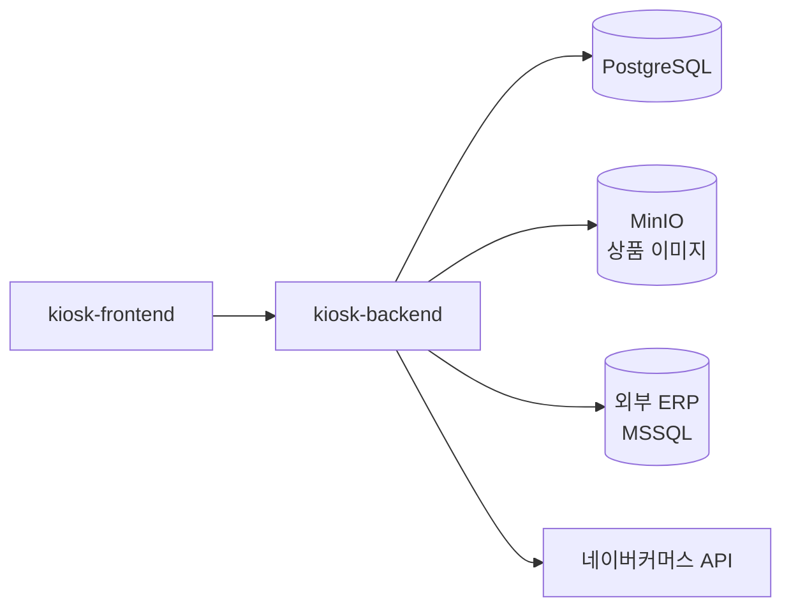

# kiosk-backend

무인 주문 시스템(비전 인식)의 코어 백엔드 — **Spring Boot · PostgreSQL · MinIO · 외부 ERP(MSSQL) · 네이버커머스 연동**

부모님 가게의 인력난을 덜기 위해 기획부터 배포·운영까지 1인으로 개발한 프로젝트입니다.
상품·주문·카테고리 관리, ERP 동기화, 판매 채널 연동, 이미지 스토리지를 담당합니다.

## 시스템 구성

전체 시스템은 4개 서비스로 구성되며, 이 저장소는 그중 코어 백엔드입니다.

| 서비스 | 역할 | 저장소 |
| --- | --- | --- |
| **kiosk-backend** | 상품·주문·ERP 동기화·채널 연동 API | (이 저장소) |
| kiosk-frontend | 주문·관리자 UI (React) | [bapdodi/kiosk-frontend](https://github.com/bapdodi/kiosk-frontend) |
| vision-backend | YOLOv8 상품 인식 · 자가학습 루프 | 비공개 |
| vision-frontend | 비전 검사 UI | 비공개 |



## 핵심 설계

- **판매 채널 연동을 Strategy 패턴으로 추상화** — `SalesChannelConnector` 인터페이스에 채널별 구현체를 붙이는 구조로, 네이버커머스를 연동했고 새 채널 추가 비용은 "구현체 1개"입니다. (`service/channel`, `service/naver`)
- **ERP 옵션조합 동기화 최적화** — 매 동기화마다 전체삭제+재삽입하던 것을 `erpCode` 맵 매칭으로 변경분만 in-place 갱신하고, 상품별 컬렉션은 `@BatchSize(500)` IN 배치 로딩으로 N+1을 제거했습니다. (`ErpSyncService`)
- **ERP 전표번호 계산 최소화** — 품목마다 외부 ERP에 `SELECT MAX(dNO)`를 반복하던 것을 주문 진입 시 1회 계산·고정으로 바꿔 외부 DB 조회를 품목 N회 → 주문당 1회로 줄였습니다.
- **LexoRank 기반 상품 정렬** — 순서 변경 시 두 이웃 사이의 rank 문자열만 갱신하는 O(1) 재정렬로, 드래그앤드롭 낙관적 UI를 지원합니다. (`util/LexoRank`)
- **이미지 캐싱** — 상품 이미지에 `Cache-Control` 7일 + ETag를 부여해 재방문 시 304로 처리합니다. 이미지는 MinIO 오브젝트 스토리지에 저장하며, 로컬 파일 → MinIO 이관용 `StorageMigrationRunner`를 포함합니다.
- **배포** — CI 배포 잡 대신 Watchtower 폴링으로 컨테이너 이미지를 자동 갱신합니다(과거 배포 잡이 운영 `.env`를 덮어쓰던 위험 제거).

## 기술 스택

Java 17 · Spring Boot (Web, Data JPA, Security, Validation) · PostgreSQL · MSSQL(외부 ERP) · MinIO · Docker / docker-compose · Watchtower

## 실행

```bash
# 로컬 (PostgreSQL + ERP용 MSSQL 컨테이너 포함)
docker compose up -d
./gradlew bootRun
```

주요 환경변수 (기본값은 `src/main/resources/application.yml` 참고):

| 변수 | 설명 |
| --- | --- |
| `SPRING_DATASOURCE_URL / USERNAME / PASSWORD` | 서비스 DB (PostgreSQL) |
| `ERP_DATASOURCE_URL / USERNAME / PASSWORD` | 외부 ERP DB (MSSQL) |
| `MINIO_ENDPOINT / ACCESS_KEY / SECRET_KEY / BUCKET` | 이미지 스토리지 |
| `NAVER_COMMERCE_CLIENT_ID / CLIENT_SECRET` | 네이버커머스 API |

## 재고 입고 관리 (ERP 매입전표 직접 기록)

경영박사(DrNet) 클라이언트는 동시접속 2대 제한이 있어 세 번째 담당자가 ERP 를 띄울 수 없습니다.
관리자 화면 `/admin/erp-receiving` 에서 입고를 입력하면 백엔드가 ERP 에 매입전표
(`IL<yy>` `KIND=4`)를 직접 기록합니다. 우리가 넣은 줄은 `BIGO2 = 'KIOSK-IN-<uuid>'` 태그로 구분됩니다.

`ITEM.JEGO`(현재고)는 기본적으로 **건드리지 않습니다**. 운영 데이터에서 기초이월+매입-매출 이
JEGO 와 일치하지 않아(경영박사가 유지하는 파생값), 임의로 더하면 이중가산되거나 재계산에 덮입니다.
복제본에서 경영박사 입고 1건의 before/after 를 대조해 확정한 뒤에만 `stock-mode` 를 바꿉니다.

| 변수 | 기본값 | 설명 |
| --- | --- | --- |
| `ERP_RECEIVING_WRITE_ENABLED` | `false` | 1단계는 읽기 전용(검색/미리보기). 검증 후 `true` |
| `ERP_RECEIVING_STOCK_MODE` | `NONE` | `NONE` \| `JEGO`. JEGO 반영 여부 |
| `ERP_RECEIVING_DATE_WINDOW_DAYS` | `7` | 입고일자를 오늘 ±N일로 제한(월마감 보호) |

쓰기를 켜기 전에 ERP DB 에 멱등 테이블을 1회 만들어야 합니다(주문 전송의 `KIOSK_ORDER_RECEIPT` 와 같은 역할):

```sql
CREATE TABLE KIOSK_RECEIPT_VOUCHER (
    REQUEST_ID   NVARCHAR(64)  NOT NULL PRIMARY KEY,
    IL_TABLE     NVARCHAR(8)   NOT NULL,
    dDATE        NVARCHAR(10)  NOT NULL,
    dNO          INT           NOT NULL,
    LINES        INT           NOT NULL,
    CREATED_AT   DATETIME2     NOT NULL,
    CREATED_BY   NVARCHAR(64)  NULL,
    CANCELLED_AT DATETIME2     NULL
);
```

운영 배포는 `docker-compose.prod.yml` + Watchtower를 사용합니다.
